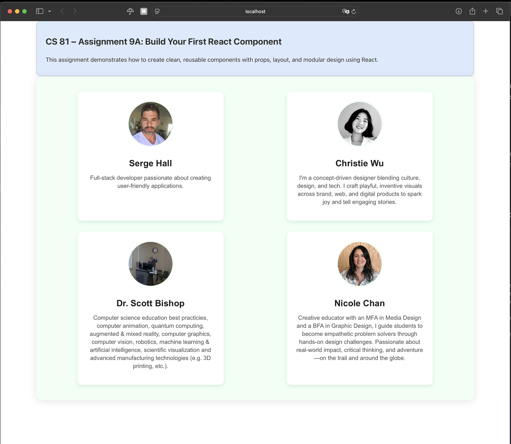

# CS81 Module 9A – Build Your First React Component

This project is part of **Module 9 Assignment 9A** for Santa Monica College's CS81 JavaScript Programming course.  
It demonstrates how to build reusable components in React using props, layout, and modular design practices.

---

## Description

This React app was created using Vite and renders a set of user profile cards using modular components.  
Each profile includes an image, name, and bio. There's also a styled assignment header and a contact card section at the bottom.

---

## Screenshot

<details>
  <summary> Click to view screenshot with comments</summary>

A screenshot of your rendered UserProfile components (showing layout and styling):



</details>

---
## Getting Started

1. **Clone the repository**

```bash
git clone https://github.com/sergehall/module9a-firstreact
cd module9a-firstreact
```

2. **Install Node.js** (if not already installed)

- Visit https://nodejs.org and download for your system.

3. **Install dependencies**
```bash
npm install
```
4. **Start the development server**
```bash
npm run dev
```

## Repository Structure

```
.
├── public/
│   └── my-new-favicon.ico
├── src/
│   ├── assets/               # Optional assets folder (e.g. images)
│   ├── components/
│   │   ├── Assignment9A.jsx
│   │   ├── AssignmentHeader.jsx
│   │   ├── ContactCard.jsx
│   │   ├── UserList.jsx
│   │   └── UserProfile.jsx
│   ├── data/
│   │   └── userProfiles.js
│   ├── styles/
│   │   └── styles.css
│   ├── App.jsx
│   ├── index.css
│   └── main.jsx
├── index.html
├── vite.config.js
└── README.md
```

---

## What I Learned

- How to set up a modern React project using Vite
- How to create and reuse functional components with props
- How to use `.map()` to render dynamic lists from data
- How to organize project structure for scalability
- How to style using external CSS and make components responsive
- How to create gradient backgrounds, custom shadows, and themed cards

---

## Challenges

- Replacing the single UserProfile component with a dynamic UserList component that maps through external data and renders multiple profiles in a responsive 2-column layout
- Making box-shadow colors subtle yet distinguishable by matching them with custom green accent colors (#b5e6cc)
- Ensuring consistent spacing, padding, and component alignment across the entire layout — especially between header, profile section, and contact block
- Implementing a scroll-aware footer that appears smoothly when scrolling up using a window.scroll listener and class toggle logic

---

## Submission Requirements

- [x] At least 4 modular React components
- [x] Vite + JSX setup
- [x] Styled layout with responsive 2-column profile grid
- [x] Contact section styled like Assignment Header
- [x] Commit messages with clear, descriptive changes

---

## License

This project is for educational use only as part of Santa Monica College's CS81 coursework.
